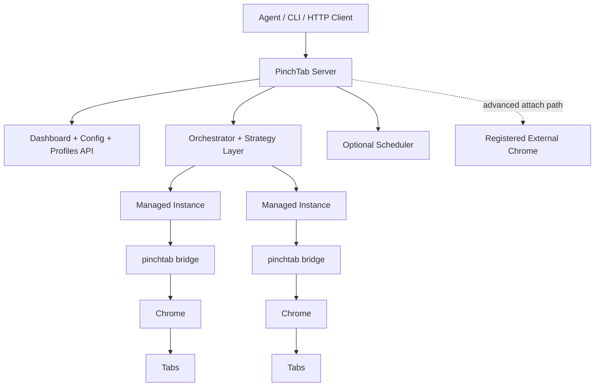
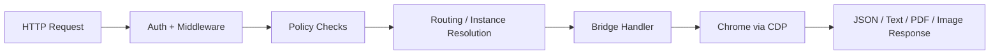

# Architecture

PinchTab is a local HTTP control plane for Chrome aimed at agent-driven browser automation. Callers talk to PinchTab over HTTP and JSON; PinchTab translates those requests into browser work through Chrome DevTools Protocol.

## Runtime Roles

PinchTab has two runtime roles:

- **Server**: `pinchtab` or `pinchtab server`
- **Bridge**: `pinchtab bridge`

Today, the main production shape is:

- the **server** manages profiles, instances, routing, and the dashboard
- each managed instance is a separate **bridge-backed** browser runtime
- the bridge owns one browser context and serves the single-instance browser API

PinchTab also supports an advanced attach path:

- the server can register an externally managed Chrome instance through `POST /instances/attach`
- attach is policy-gated by `security.attach.enabled`, `security.attach.allowHosts`, and `security.attach.allowSchemes`

The current managed implementation is bridge-backed. Any direct-CDP-only managed model is architectural discussion elsewhere, not the default runtime path in this codebase.

## System Overview



## Request Flow

For the normal multi-instance server path, the flow is:



Important details:

- auth and common middleware run at the HTTP layer
- policy checks include attach policy and, when enabled, IDPI protections
- tab-scoped routes are resolved to the owning instance before execution
- the bridge runtime performs the actual CDP work

In bridge-only mode, the orchestrator and multi-instance routing layers are skipped, but the same browser handler model still applies.

## Current Architecture

The current implementation centers on these pieces:

- **Profiles**: persistent browser state stored on disk
- **Instances**: running browser runtimes associated with profiles or external CDP URLs
- **Tabs**: the main execution surface for navigation, extraction, and actions
- **Orchestrator**: launches, tracks, stops, and proxies managed instances
- **Bridge**: owns the browser context, tab registry, ref cache, and action execution

The main instance types in practice are:

- **managed bridge-backed instances** launched by the server
- **attached external instances** registered through the attach API

## Security And Policy Layer

PinchTab's protection logic lives in the HTTP handler layer, not in the caller and not in Chrome itself.

When `security.idpi` is enabled, the current implementation can:

- block or warn on navigation targets using domain policy
- scan `/text` output for common prompt-injection patterns
- scan `/snapshot` content for the same class of patterns
- wrap `/text` output in `<untrusted_web_content>` when configured

Architecturally, this keeps policy separate from routing and execution:

```text
request -> middleware/policy -> routing -> execution -> response
```

## Design Principles

- **HTTP for callers**: agents and tools talk to PinchTab over HTTP, not raw CDP
- **A11y-first interaction**: snapshots and refs are the primary structured interface
- **Instance isolation**: managed instances run separately and keep isolated browser state
- **Tab-scoped execution**: once a tab is known, actions route to that tab's owning runtime
- **Optional coordination layers**: strategy routing and the scheduler sit above the same browser execution surface

## Code Map

The most important packages for the current architecture are:

- `cmd/pinchtab`: process startup modes and CLI entrypoints
- `internal/orchestrator`: instance lifecycle, attach, and tab-to-instance proxying
- `internal/bridge`: browser runtime, tab state, and CDP execution
- `internal/handlers`: single-instance HTTP handlers
- `internal/profiles`: persistent profile management
- `internal/strategy`: server-side routing behavior for shorthand requests
- `internal/scheduler`: optional queued task dispatch
- `internal/config`: runtime and file config loading
