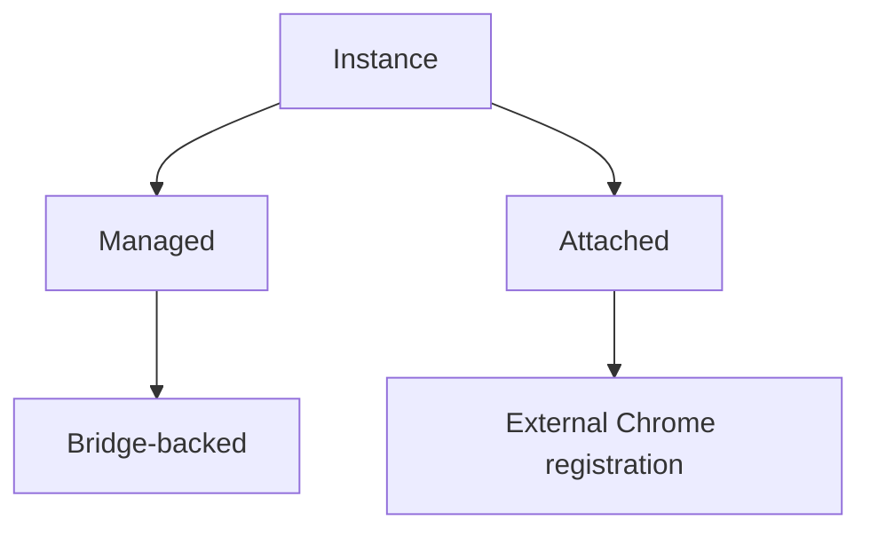
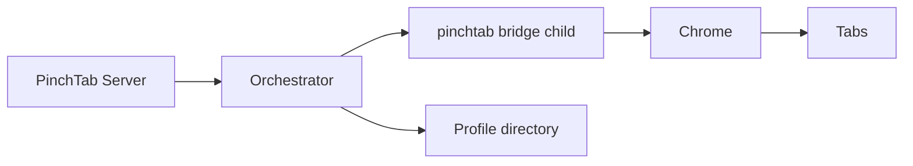
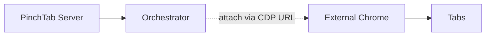
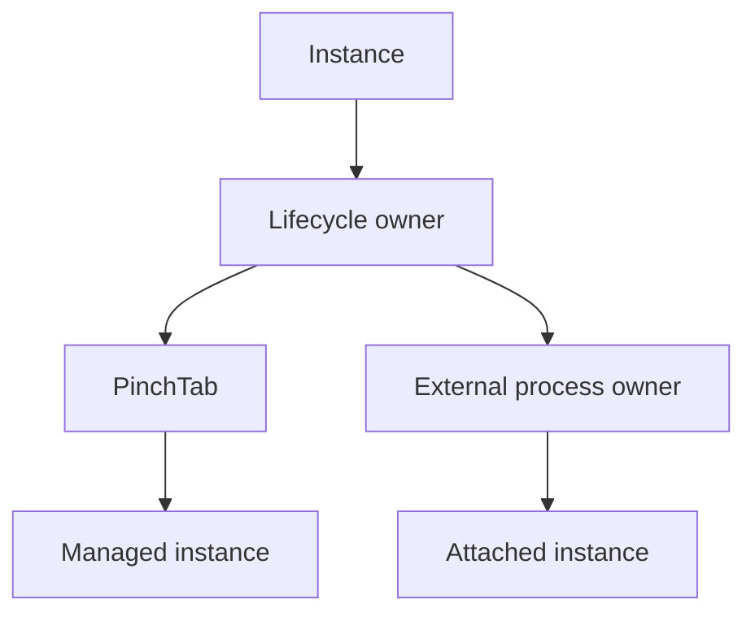
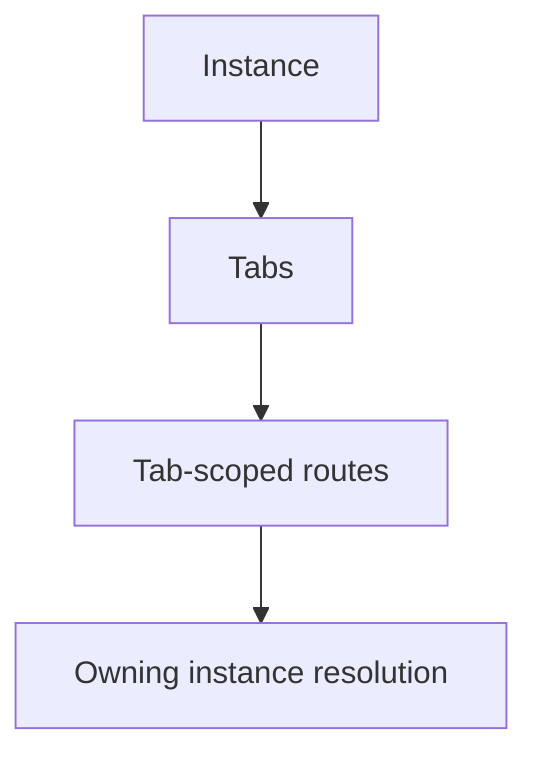

# Instance Charts

This page captures the current instance model in PinchTab.

It is intentionally limited to the instance types and relationships that exist now in the codebase.

## Chart 1: Current Instance Types

Current meaning:

- **managed** means PinchTab launches and owns the runtime lifecycle
- **attached** means PinchTab registers an already running external Chrome
- **bridge-backed** means the server reaches the browser through a `pinchtab bridge` runtime

## Chart 2: Managed Instance Shape

For managed instances today:

- the orchestrator launches a bridge child process
- the bridge owns one browser runtime
- tabs live inside that runtime
- browser state is tied to the associated profile directory

## Chart 3: Attached Instance Shape

For attached instances today:

- PinchTab does not launch the browser
- PinchTab stores registration metadata in the instance registry
- ownership of the external browser process stays outside PinchTab
- attached registration exists today, but the normal managed-instance tab proxy path is still centered on bridge-backed instances

## Chart 4: Ownership Model

This is the key distinction:

- managed instances are lifecycle-owned by PinchTab
- attached instances are tracked by PinchTab but not process-owned by PinchTab

## Chart 5: Routing Relationship

The important runtime rule is:

- tabs belong to one instance
- for managed bridge-backed instances, tab-scoped server routes are resolved to the owning instance before proxying

## Current Instance Fields

The main instance fields surfaced by the current API are:

- `id`
- `profileId`
- `profileName`
- `port`
- `headless`
- `status`
- `startTime`
- `error`
- `attached`
- `cdpUrl`

Useful interpretation:

- `attached: false` usually means a managed bridge-backed instance
- `attached: true` means an externally registered instance
- `port` is relevant for managed bridge-backed instances
- `cdpUrl` is relevant for attached instances
