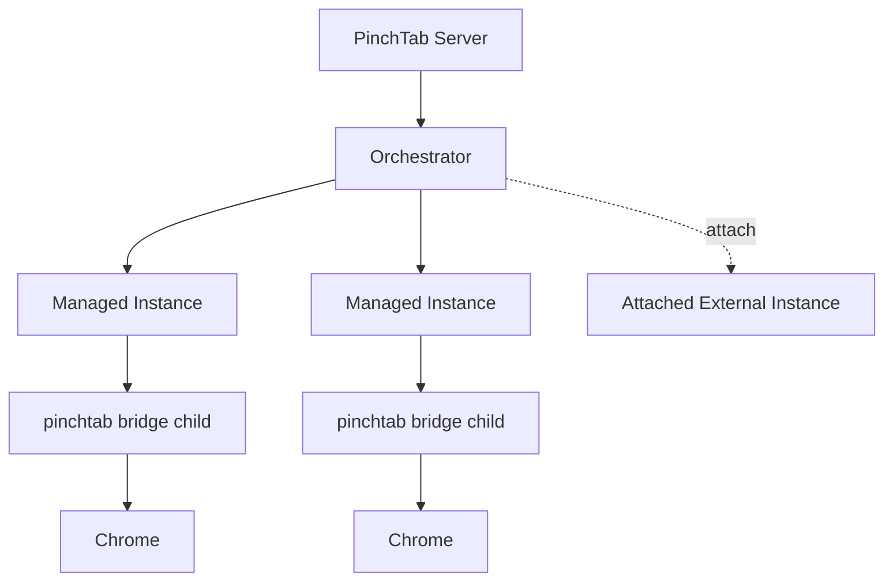
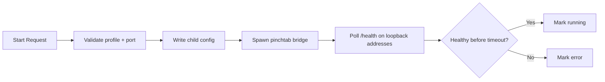
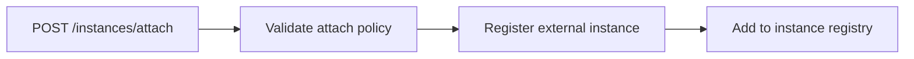
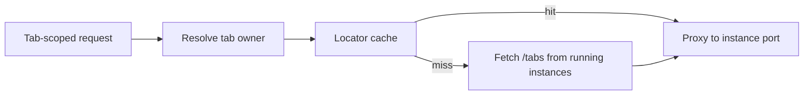
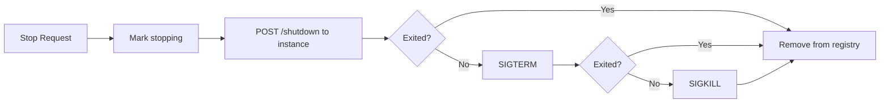

# Orchestration

This page describes the current orchestration layer in PinchTab: how the server launches, tracks, routes to, and stops browser instances.

## Scope

The orchestrator is part of server mode. It is responsible for:

- launching managed instances as child `pinchtab bridge` processes
- attaching externally managed Chrome instances when attach policy allows it
- tracking instance status and metadata
- routing tab-scoped requests to the owning managed instance
- stopping managed instances and cleaning up registry state

It does not execute browser actions directly. That work happens inside the bridge runtime.

## Current Runtime Shape

## Launch Flow

For a managed instance, the orchestration flow is:

What the code does today:

- validates the profile name before launch
- allocates a port when one is not supplied
- prevents more than one active managed instance per profile
- prevents reusing a port already in use
- writes a child config file under the profile state directory
- launches `pinchtab bridge`
- polls `/health` on `127.0.0.1`, `::1`, and `localhost`
- moves the instance from `starting` to `running` or `error`

## Attach Flow

Attach is a separate path for an already running browser.

Current attach behavior:

- requires `security.attach.enabled`
- validates the CDP URL against `security.attach.allowSchemes`
- validates the host against `security.attach.allowHosts`
- registers the instance as `attached: true`
- does not start or stop an external Chrome process

## Routing Model

The orchestrator is also the routing layer for multi-instance server mode.

Today, tab routing works like this:

- for routes such as `/tabs/{id}/navigate` and `/tabs/{id}/action`, the server resolves which instance owns the tab
- it first tries the instance locator cache
- on cache miss, it falls back to scanning running instances through `/tabs`
- after resolution, it proxies the request to the owning bridge instance

This keeps the public server API stable while the bridge instances remain isolated.

Important limitation:

- this routing path is fully shaped around managed bridge-backed instances that expose loopback HTTP ports
- attached instances are registered and surfaced in the instance registry, but the normal tab-owner proxy path is not yet equally first-class for them

## Stop Flow

Stopping a managed instance is a server-owned lifecycle operation.

Current stop behavior:

- marks the instance as `stopping`
- tries graceful shutdown through the instance HTTP API
- falls back to process-group termination when needed
- releases the allocated port
- removes the instance from the registry and locator cache

For attached instances, there is no child process to kill; the orchestrator only removes its own registration state.

## Instance States

The main statuses surfaced today are:

- `starting`
- `running`
- `stopping`
- `stopped`
- `error`

The orchestrator also emits lifecycle events such as:

- `instance.started`
- `instance.stopped`
- `instance.error`
- `instance.attached`

## Relationship To Other Layers

- **Strategy layer** decides how shorthand requests are exposed or routed in server mode
- **Scheduler** is optional and sits above the same routed execution path
- **Bridge** owns browser state, tab state, and CDP execution
- **Profiles** provide persistent browser data on disk
