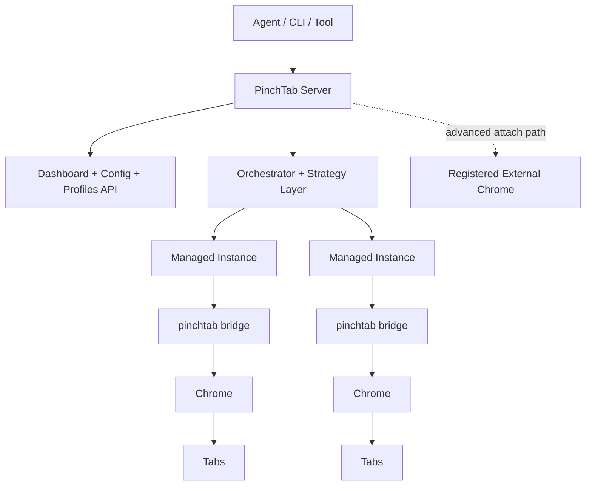
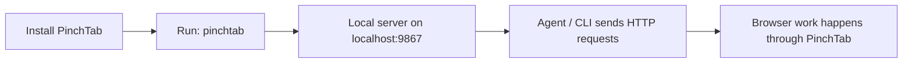
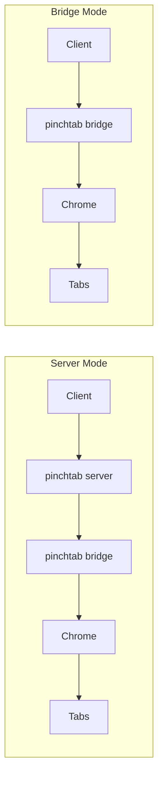
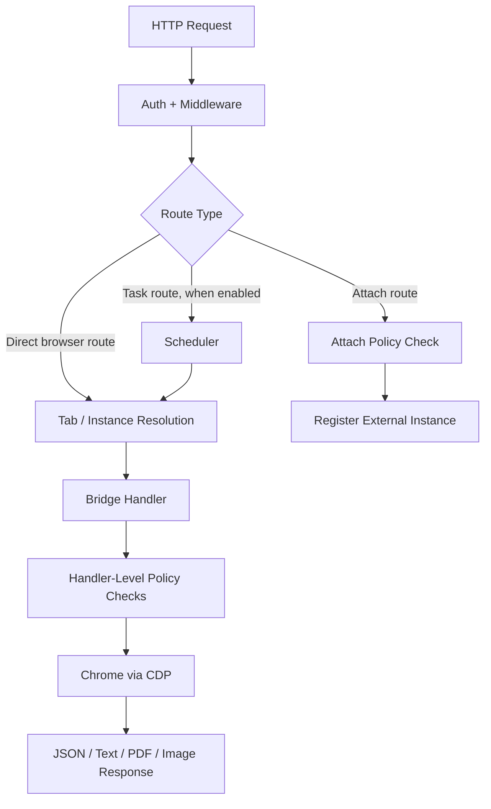

# System Charts

This page collects the main high-level charts for the current PinchTab architecture.

## Chart 1: Product Shape

This is the default system shape today:

- agents talk to the server over HTTP
- the server manages profiles, instances, and routing
- managed instances are bridge-backed
- attach exists as an advanced external-browser registration path

## Chart 2: Primary Usage Path

This is the normal mental model for users. Most users should think about `pinchtab`, not `pinchtab bridge`.

## Chart 3: Runtime Shapes

Meaning:

- **server mode** is the multi-instance control-plane path
- **bridge mode** is the single-instance browser runtime

## Chart 4: Current Request Paths

Important details:

- auth and shared middleware run at the HTTP layer
- attach policy is enforced on the attach route in the server
- IDPI and similar browser-facing checks run in handlers such as navigation, text, and snapshot
- tab-scoped routes are resolved to the owning instance before execution
- the scheduler is optional, server-only, and applies to `/tasks`
- bridge handlers perform the actual browser work
