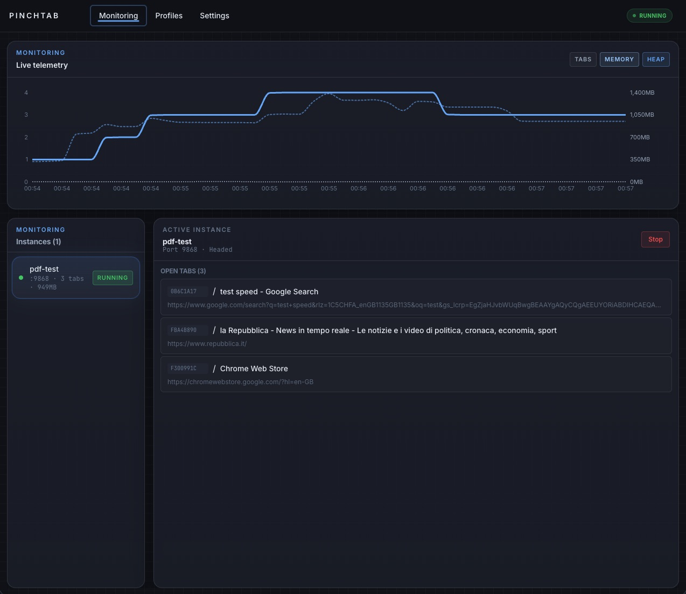
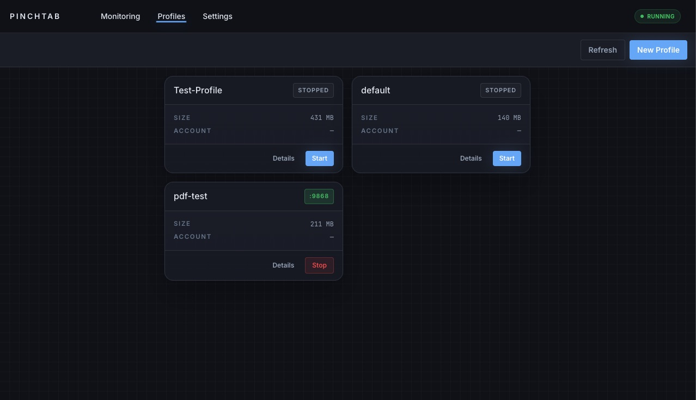
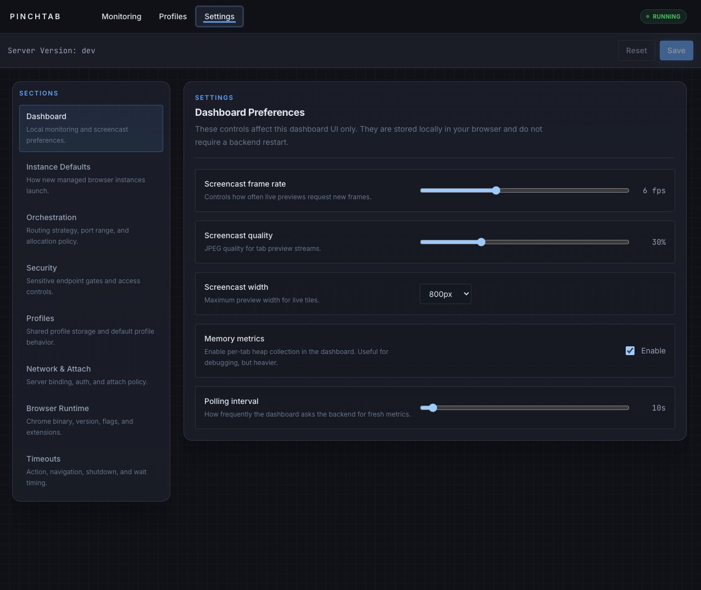

# Dashboard

PinchTab includes a built-in web dashboard for monitoring instances, managing profiles, and editing configuration.

The dashboard is part of the full server:

- `pinchtab` or `pinchtab server` starts the full server and serves the dashboard
- `pinchtab bridge` does not serve the dashboard

You can open the dashboard at:

- `http://localhost:9867`
- `http://localhost:9867/dashboard`

---

## Dashboard overview

The current dashboard exposes three main pages:

1. **Monitoring**
2. **Profiles**
3. **Settings**

The UI is a React SPA served by the Go server.

---

## Monitoring page



The Monitoring page is the default view.

It shows:

- running and stopped instances
- selected-instance details
- open tabs for the selected instance
- charted monitoring data
- optional memory metrics when enabled in settings

What you can do:

- select an instance
- inspect its port, mode, and status
- view its open tabs
- stop a running instance

Operational data comes from:

- SSE updates on `GET /api/events`
- instance lists from `GET /instances`
- tab data from `GET /instances/{id}/tabs`
- optional memory data from `GET /instances/metrics`

---

## Profiles page



The Profiles page manages saved browser profiles.

It shows:

- available profiles
- launch and stop actions
- profile metadata such as name, path, size, source, and account details

What you can do:

- create a new profile
- launch a profile as a managed instance
- stop the running instance for a profile
- edit profile metadata
- delete a profile
- open a profile details modal

The launch flow uses the server APIs behind the scenes:

```bash
curl -X POST http://localhost:9867/profiles \
  -H "Content-Type: application/json" \
  -d '{"name":"work","useWhen":"Team account workflows"}'
# Response
{
  "status": "created",
  "id": "prof_278be873",
  "name": "work"
}
```

```bash
curl -X POST http://localhost:9867/instances/start \
  -H "Content-Type: application/json" \
  -d '{"profileId":"prof_278be873","mode":"headed"}'
# CLI Alternative
pinchtab instance start --profileId prof_278be873 --mode headed
# Response
{
  "id": "inst_ea2e747f",
  "profileId": "prof_278be873",
  "profileName": "work",
  "port": "9868",
  "headless": false,
  "status": "starting"
}
```

---

## Profile details modal

Profile details are shown in a modal, not as a separate top-level page.

The modal currently includes tabs for:

- **Profile**
- **Live**
- **Logs**

From there you can:

- view the profile ID and metadata
- edit name and `useWhen`
- inspect live tabs for a running instance
- open a screencast tile for tab previews

---

## Settings page



The Settings page combines local dashboard preferences with backend configuration.

It includes sections for:

- Dashboard
- Instance Defaults
- Orchestration
- Security
- Profiles
- Network & Attach
- Browser Runtime
- Timeouts

What you can do:

- change local dashboard preferences such as monitoring and screencast settings
- load backend config from `GET /api/config`
- save backend config through `PUT /api/config`
- see whether a restart is required for server-level changes

The health payload also surfaces summary info:

```bash
curl http://localhost:9867/health | jq .
# Response
{
  "status": "ok",
  "mode": "dashboard",
  "profiles": 3,
  "instances": 1,
  "agents": 0,
  "restartRequired": false
}
```

---

## Event stream

The dashboard uses Server-Sent Events, not WebSockets.

Primary stream endpoint:

```bash
curl http://localhost:9867/api/events
```

This stream carries:

- `init`
- `action`
- `system`
- `monitoring`

---

## Build note

If the React dashboard assets are not built into the binary, the server serves a fallback page telling you to build the dashboard bundle.

---

## Troubleshooting

### Dashboard not loading

```bash
curl http://localhost:9867/health
```

If the server is up, try:

- `http://localhost:9867`
- `http://localhost:9867/dashboard`

### No instances visible

Start one:

```bash
curl -X POST http://localhost:9867/instances/start \
  -H "Content-Type: application/json" \
  -d '{"mode":"headless"}'
# CLI Alternative
pinchtab instance start
```

### No live profile preview

The profile must have a running instance before the Live tab in the profile details modal can show live tab data.

